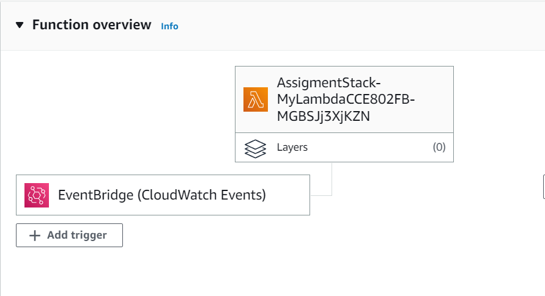

# AWS Lambda Function and CDK Deployment
This project includes a Lambda function that pulls data from an API endpoint and logs the output, using Typescript. The CDK library is used to deploy and create the Lambda function and run it in AWS.

## Functionality

The Lambda function connects to the API endpoint provided by FETCH_URL and retrieves data. It then logs the data to the console and returns it in JSON format. 

## Deployment

The Lambda function is deployed to AWS using the AWS Cloud Development Kit (CDK) library. The CDK is used to create a new Lambda function and schedule it to run every hour using CloudWatch Events.



## Usage

To use this Lambda function, you will need to have an AWS account set up and configured on your local machine. You can deploy the function by running the following commands in the terminal:

``` 
npm install
npm run build
cdk bootstrap
cdk synth
cdk deploy
```
